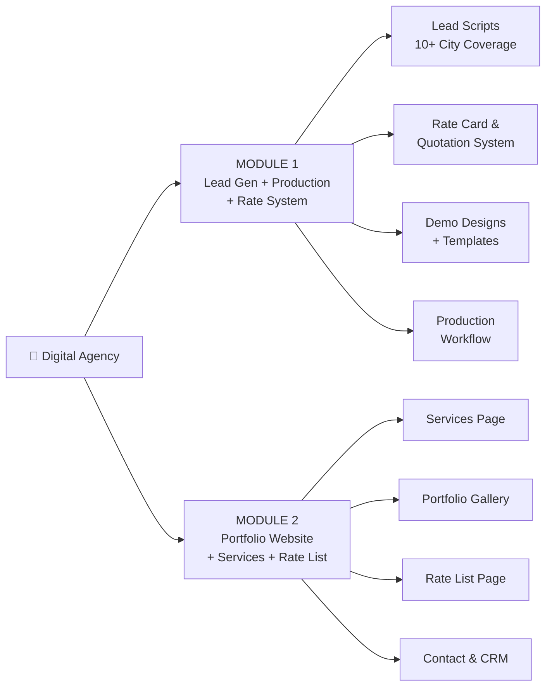
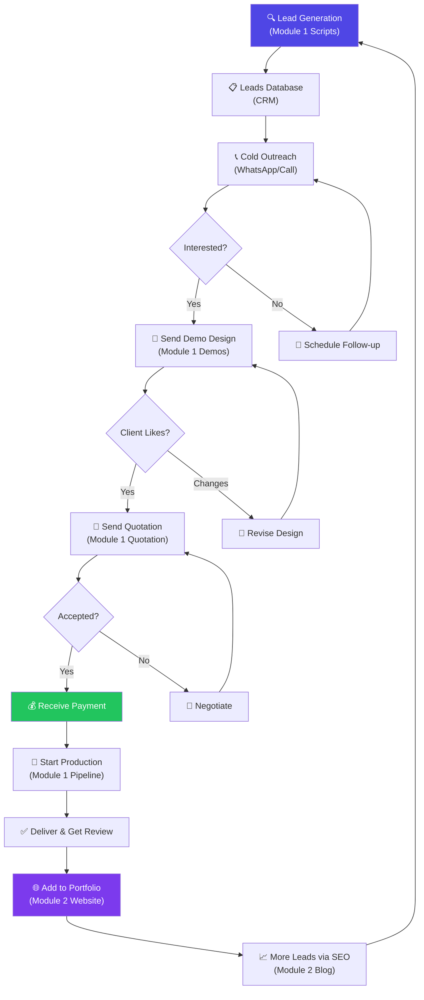

# 🚀 Digital Agency Master Plan — 2 Modules

> **Business:** Digital Marketing & Web Development Agency  
> **Coverage Area:** North India — Rajasthan, Delhi NCR, Haryana, Gujarat  
> **Target:** Local Businesses (Restaurants, Hospitals, Properties, Tour & Travels, Shops, etc.)

---

## 📋 Overview



---

## 🟢 MODULE 1: Lead Generation & Production System

### What's Inside:
| Component | Description |
|-----------|-------------|
| 🎯 Lead Generation Scripts | Google Maps scraper, JustDial scraper, IndiaMart scraper — city-wise |
| 📊 Rate Card System | Dynamic pricing with packages (Basic/Standard/Premium) |
| 📝 Quotation Generator | Auto-generate PDF quotations with branding |
| 🎨 Demo Design Templates | Ready-made demo designs for each business category |
| ⚙️ Production Workflow | Task tracking, client onboarding, delivery pipeline |
| 📱 WhatsApp/Email Templates | Cold outreach message templates |
| 📈 CRM Dashboard | Track leads, follow-ups, conversions |

### Cities Covered:
- **Rajasthan:** Jaipur, Jodhpur, Udaipur, Kota, Ajmer, Bikaner, Alwar, Bharatpur
- **Delhi NCR:** Delhi, Noida, Gurgaon, Faridabad, Ghaziabad, Greater Noida
- **Haryana:** Chandigarh, Ambala, Karnal, Panipat, Hisar, Rohtak
- **Gujarat:** Ahmedabad, Surat, Vadodara, Rajkot, Gandhinagar

### Business Categories:
🏥 Hospitals & Clinics | 🏨 Hotels & Resorts | ✈️ Tour & Travels | 🍕 Restaurants & Cafes | 🏠 Real Estate & Properties | 🛍️ Local Shops & Retail | 💇 Salons & Spas | 🏫 Coaching & Education | 🔧 Service Providers | 🏗️ Builders & Contractors

---

## 🔵 MODULE 2: Portfolio & Services Website

### What's Inside:
| Page | Description |
|------|-------------|
| 🏠 Home | Hero section, stats, client logos, CTA |
| 💼 Services | All services with pricing tiers |
| 🎨 Portfolio | Project gallery with filters (by category, city) |
| 💰 Rate List | Transparent pricing table |
| 📞 Contact | Form + WhatsApp integration + Google Maps |
| 📝 Blog | SEO content for local ranking |
| ⭐ Testimonials | Client reviews with video/image |

---

# 🔥 ANTIGRAVITY IDE PROMPTS

---

## 📌 PROMPT 1: Module 1 — Lead Generation & CRM System (Full Stack App)

> Copy this prompt and paste in Antigravity IDE:

````
Bhai ek full-stack Lead Generation & Business Production System banao. Yeh ek digital marketing agency ka internal tool hai jo North India mein local businesses ko target karta hai.

## Tech Stack:
- Frontend: Next.js 14 (App Router) + Tailwind CSS + shadcn/ui
- Backend: Next.js API Routes
- Database: SQLite with Prisma ORM (local development ke liye)
- PDF Generation: @react-pdf/renderer
- Export: CSV/Excel export support

## Folder Structure:
```
module-1-lead-system/
├── prisma/
│   └── schema.prisma          # Database schema
├── src/
│   ├── app/
│   │   ├── layout.tsx
│   │   ├── page.tsx           # Dashboard
│   │   ├── leads/
│   │   │   ├── page.tsx       # All leads list
│   │   │   ├── [id]/page.tsx  # Lead detail
│   │   │   └── import/page.tsx # CSV import
│   │   ├── quotation/
│   │   │   ├── page.tsx       # Create quotation
│   │   │   ├── [id]/page.tsx  # View quotation
│   │   │   └── templates/page.tsx
│   │   ├── rate-card/
│   │   │   ├── page.tsx       # Rate card manager
│   │   │   └── public/page.tsx # Shareable rate card
│   │   ├── demos/
│   │   │   ├── page.tsx       # Demo designs gallery
│   │   │   └── [category]/page.tsx
│   │   ├── scripts/
│   │   │   └── page.tsx       # Lead gen scripts manager
│   │   ├── production/
│   │   │   └── page.tsx       # Production pipeline
│   │   └── api/
│   │       ├── leads/route.ts
│   │       ├── quotation/route.ts
│   │       ├── rate-card/route.ts
│   │       └── export/route.ts
│   ├── components/
│   │   ├── ui/               # shadcn components
│   │   ├── dashboard/
│   │   ├── leads/
│   │   ├── quotation/
│   │   └── common/
│   ├── lib/
│   │   ├── db.ts
│   │   ├── utils.ts
│   │   └── constants.ts
│   └── data/
│       ├── cities.ts          # All North India cities data
│       ├── categories.ts      # Business categories
│       ├── rate-cards.ts      # Default rate card data
│       ├── templates/         # Message templates
│       │   ├── whatsapp.ts
│       │   └── email.ts
│       └── demo-designs.ts    # Demo design metadata
├── public/
│   └── demos/                 # Demo design images
└── scripts/
    ├── google-maps-scraper.ts # Lead gen script
    ├── justdial-scraper.ts
    └── bulk-message.ts
```

## Database Schema (Prisma):
```prisma
model Lead {
  id            String   @id @default(cuid())
  businessName  String
  ownerName     String?
  phone         String
  email         String?
  website       String?
  category      String   // restaurant, hospital, hotel, etc.
  city          String
  state         String
  address       String?
  rating        Float?
  status        String   @default("new") // new, contacted, interested, converted, rejected
  source        String?  // google_maps, justdial, manual, referral
  notes         String?
  followUpDate  DateTime?
  createdAt     DateTime @default(now())
  updatedAt     DateTime @updatedAt
  quotations    Quotation[]
  activities    Activity[]
}

model Quotation {
  id            String   @id @default(cuid())
  quotationNo   String   @unique
  leadId        String
  lead          Lead     @relation(fields: [leadId], references: [id])
  clientName    String
  clientBusiness String
  clientPhone   String
  clientEmail   String?
  items         Json     // Array of {service, description, price, qty}
  subtotal      Float
  discount      Float    @default(0)
  tax           Float    @default(0)
  total         Float
  validUntil    DateTime
  status        String   @default("draft") // draft, sent, accepted, rejected
  notes         String?
  createdAt     DateTime @default(now())
  updatedAt     DateTime @updatedAt
}

model RateCard {
  id          String @id @default(cuid())
  service     String
  category    String
  basicPrice  Float
  standardPrice Float
  premiumPrice Float
  description String?
  features    Json   // Array of features per tier
  isActive    Boolean @default(true)
}

model Activity {
  id        String   @id @default(cuid())
  leadId    String
  lead      Lead     @relation(fields: [leadId], references: [id])
  type      String   // call, whatsapp, email, meeting, note
  content   String
  createdAt DateTime @default(now())
}

model Project {
  id          String   @id @default(cuid())
  clientName  String
  projectType String
  status      String   @default("pending") // pending, designing, development, review, delivered
  deadline    DateTime?
  assignedTo  String?
  price       Float
  paidAmount  Float    @default(0)
  createdAt   DateTime @default(now())
  updatedAt   DateTime @updatedAt
}
```

## Features Required:

### 1. Dashboard (page.tsx)
- Total leads count (by status), today's follow-ups
- Revenue this month, pending payments
- Recent activities timeline
- City-wise lead distribution chart
- Category-wise breakdown pie chart
- Quick actions: Add Lead, Create Quotation, View Rate Card

### 2. Leads Management (/leads)
- DataTable with search, filter (by city, category, status, source)
- Bulk import via CSV upload
- Lead detail page with:
  - Contact info, business details
  - Activity timeline (calls, messages, meetings)
  - Add notes & schedule follow-up
  - Generate quotation from lead
  - Status change with color coding
- Add lead form with all fields
- Export leads to CSV/Excel

### 3. Rate Card System (/rate-card)
- Services list with 3-tier pricing:

| Service | Basic | Standard | Premium |
|---------|-------|----------|---------|
| Business Website (5 pages) | ₹4,999 | ₹9,999 | ₹19,999 |
| E-commerce Website | ₹14,999 | ₹29,999 | ₹49,999 |
| Google My Business Setup | ₹1,999 | ₹3,999 | ₹6,999 |
| Social Media Management (Monthly) | ₹4,999 | ₹9,999 | ₹19,999 |
| Logo Design | ₹999 | ₹2,999 | ₹5,999 |
| SEO (Monthly) | ₹4,999 | ₹9,999 | ₹19,999 |
| Google Ads Management (Monthly) | ₹3,999 | ₹7,999 | ₹14,999 |
| Facebook/Instagram Ads (Monthly) | ₹3,999 | ₹7,999 | ₹14,999 |
| Video Editing (Per Video) | ₹999 | ₹2,999 | ₹5,999 |
| Complete Digital Package (Monthly) | ₹14,999 | ₹29,999 | ₹49,999 |
| Visiting Card Design | ₹499 | ₹999 | ₹1,999 |
| Menu/Brochure Design | ₹1,999 | ₹3,999 | ₹7,999 |
| App Development | ₹29,999 | ₹59,999 | ₹1,49,999 |

- Editable rate card (admin can update prices)
- Public shareable rate card page (beautiful design)
- PDF export of rate card

### 4. Quotation System (/quotation)
- Create quotation form:
  - Select client from leads or enter manually
  - Add line items (service, qty, rate, amount)
  - Apply discount (% or flat)
  - Add GST (18%)
  - Set validity period
  - Add terms & conditions
- Quotation preview (professional design with company branding)
- Download as PDF
- Send via WhatsApp (wa.me link)
- Quotation numbering: QT-2024-001, QT-2024-002...
- Status tracking: Draft → Sent → Accepted/Rejected

### 5. Demo Designs Gallery (/demos)
- Category-wise demo designs:
  - Restaurant website demos
  - Hospital/clinic website demos
  - Hotel/resort website demos
  - Real estate website demos
  - Tour & travel website demos
  - Salon/spa website demos
  - School/coaching website demos
  - General business website demos
- Each demo has: Screenshot, live preview link, category tag
- Share demo link with client via WhatsApp

### 6. Lead Generation Scripts (/scripts)
- Google Maps Data Extractor UI:
  - Input: City + Category (e.g., "Restaurants in Jaipur")
  - Output: Business Name, Phone, Address, Rating, Website
  - Save to database or export CSV
- Pre-configured search queries for all cities/categories
- Script execution logs

### 7. Production Pipeline (/production)
- Kanban board: Pending → Designing → Development → Review → Delivered
- Drag-and-drop cards
- Each card shows: Client, project type, deadline, assigned person
- Payment tracking per project

### 8. WhatsApp/Email Templates
- Pre-written templates stored in data/templates/:

**WhatsApp Cold Outreach:**
```
🙏 नमस्ते {owner_name} जी,

मैं {your_name}, {your_company} से बोल रहा हूँ।

मैंने आपका {business_name} Google पर देखा। आपकी {category} बहुत अच्छी है! 👍

क्या आपकी कोई website है? अगर नहीं, तो हम सिर्फ ₹4,999 में एक professional website बना सकते हैं जिससे आपको online customers मिलेंगे।

🎁 Special Offer: पहले 10 clients को 20% discount!

क्या मैं आपको एक demo भेज सकता हूँ?
```

**Follow-up Template:**
```
🙏 {owner_name} जी, नमस्ते!

पिछली बार हमने {business_name} की website के बारे में बात की थी।

मैंने आपके लिए एक FREE demo design बना दी है! 🎨
👉 {demo_link}

ये देखिए और बताइये कैसी लगी?

Starting price सिर्फ ₹{price} है, EMI option भी available है! 🤝
```

### 9. City & Category Data
Pre-load these in src/data/:

**cities.ts:**
```typescript
export const STATES = {
  rajasthan: {
    name: "Rajasthan",
    cities: ["Jaipur", "Jodhpur", "Udaipur", "Kota", "Ajmer", "Bikaner", "Alwar", "Bharatpur", "Sri Ganganagar", "Sikar", "Bhilwara", "Pali", "Tonk"]
  },
  delhi_ncr: {
    name: "Delhi NCR",
    cities: ["New Delhi", "Noida", "Greater Noida", "Gurgaon", "Faridabad", "Ghaziabad", "Meerut"]
  },
  haryana: {
    name: "Haryana",
    cities: ["Chandigarh", "Ambala", "Karnal", "Panipat", "Hisar", "Rohtak", "Sonipat", "Rewari"]
  },
  gujarat: {
    name: "Gujarat",
    cities: ["Ahmedabad", "Surat", "Vadodara", "Rajkot", "Gandhinagar", "Jamnagar", "Bhavnagar", "Junagadh"]
  }
};
```

**categories.ts:**
```typescript
export const CATEGORIES = [
  { id: "restaurant", name: "Restaurant & Cafe", icon: "🍕", searchTerms: ["restaurant", "cafe", "dhaba", "sweet shop"] },
  { id: "hospital", name: "Hospital & Clinic", icon: "🏥", searchTerms: ["hospital", "clinic", "doctor", "dental"] },
  { id: "hotel", name: "Hotel & Resort", icon: "🏨", searchTerms: ["hotel", "resort", "guest house", "dharamshala"] },
  { id: "tour_travel", name: "Tour & Travels", icon: "✈️", searchTerms: ["tour", "travel agency", "cab service"] },
  { id: "real_estate", name: "Real Estate", icon: "🏠", searchTerms: ["property dealer", "real estate", "builder", "flat"] },
  { id: "retail", name: "Retail Shop", icon: "🛍️", searchTerms: ["shop", "store", "showroom", "boutique"] },
  { id: "salon", name: "Salon & Spa", icon: "💇", searchTerms: ["salon", "spa", "beauty parlour", "barber"] },
  { id: "education", name: "Education & Coaching", icon: "🏫", searchTerms: ["coaching", "school", "tuition", "institute"] },
  { id: "gym", name: "Gym & Fitness", icon: "💪", searchTerms: ["gym", "fitness", "yoga", "sports"] },
  { id: "auto", name: "Auto & Garage", icon: "🚗", searchTerms: ["garage", "car service", "auto parts", "mechanic"] },
  { id: "event", name: "Event & Wedding", icon: "🎉", searchTerms: ["event planner", "wedding", "tent house", "caterer"] },
  { id: "other", name: "Other Business", icon: "🏢", searchTerms: ["business", "company", "service"] }
];
```

## Design:
- Dark theme with gradient accents (indigo to purple)
- Hindi + English mixed UI (as the target audience speaks Hindi)
- Mobile responsive
- Professional dashboard look similar to HubSpot/Zoho CRM
- Use Lucide React icons
- Toast notifications for actions
- Loading skeletons

## Important Notes:
- Sab prices INR (₹) mein honge
- Date format: DD/MM/YYYY (Indian format)
- Phone format: +91 XXXXX XXXXX
- WhatsApp integration via wa.me links
- All data local (SQLite) — no external API keys needed for basic setup
- Seed the database with 50 sample leads across different cities and categories
````

---

## 📌 PROMPT 2: Module 2 — Portfolio & Services Website

> Copy this prompt and paste in Antigravity IDE:

````
Bhai ek professional portfolio website banao mere digital marketing agency ke liye. Modern, fast, SEO-friendly — client ko dikhao to impress ho jaye!

## Tech Stack:
- Next.js 14 (App Router) + TypeScript
- Tailwind CSS + Framer Motion (animations)
- shadcn/ui components
- Static site — no database needed (all data in JSON/TS files)

## Folder Structure:
```
module-2-portfolio/
├── src/
│   ├── app/
│   │   ├── layout.tsx
│   │   ├── page.tsx           # Home
│   │   ├── services/page.tsx  # All services
│   │   ├── portfolio/page.tsx # Work portfolio
│   │   ├── pricing/page.tsx   # Rate list / packages
│   │   ├── about/page.tsx     # About us
│   │   ├── contact/page.tsx   # Contact form
│   │   ├── blog/page.tsx      # Blog listing
│   │   └── blog/[slug]/page.tsx
│   ├── components/
│   │   ├── layout/
│   │   │   ├── Navbar.tsx
│   │   │   ├── Footer.tsx
│   │   │   └── MobileMenu.tsx
│   │   ├── home/
│   │   │   ├── HeroSection.tsx
│   │   │   ├── StatsCounter.tsx
│   │   │   ├── ServicesPreview.tsx
│   │   │   ├── PortfolioPreview.tsx
│   │   │   ├── TestimonialsSlider.tsx
│   │   │   ├── WhyChooseUs.tsx
│   │   │   ├── ProcessSteps.tsx
│   │   │   ├── CTASection.tsx
│   │   │   └── ClientLogos.tsx
│   │   ├── services/
│   │   │   ├── ServiceCard.tsx
│   │   │   └── ServiceDetail.tsx
│   │   ├── portfolio/
│   │   │   ├── ProjectCard.tsx
│   │   │   └── ProjectFilter.tsx
│   │   ├── pricing/
│   │   │   ├── PricingCard.tsx
│   │   │   └── PricingToggle.tsx
│   │   ├── common/
│   │   │   ├── SectionHeading.tsx
│   │   │   ├── WhatsAppButton.tsx
│   │   │   ├── ScrollToTop.tsx
│   │   │   └── AnimatedCounter.tsx
│   │   └── ui/
│   ├── data/
│   │   ├── services.ts
│   │   ├── portfolio.ts
│   │   ├── pricing.ts
│   │   ├── testimonials.ts
│   │   ├── team.ts
│   │   └── blog.ts
│   ├── lib/
│   │   └── utils.ts
│   └── styles/
│       └── globals.css
└── public/
    ├── images/
    └── icons/
```

## Company Info (use throughout the site):
```typescript
export const COMPANY = {
  name: "DigiPro Solutions",
  tagline: "आपका Digital Partner",
  description: "North India's trusted digital marketing & web development agency. We help local businesses grow online.",
  phone: "+91 98765 43210",
  email: "hello@digiprosolutions.in",
  whatsapp: "919876543210",
  address: "Jaipur, Rajasthan, India",
  foundedYear: 2022,
  clientsServed: "500+",
  citiesCovered: "50+",
  projectsDelivered: "1200+",
  socialLinks: {
    instagram: "#",
    facebook: "#",
    linkedin: "#",
    youtube: "#"
  }
};
```

## Pages Detail:

### 1. HOME PAGE (page.tsx)
Full landing page with these sections (each with smooth scroll-in animation):

**Hero Section:**
- Big headline: "हम बनाते हैं आपका Digital Business 🚀"
- Subline: "Website, SEO, Google Ads, Social Media — सब कुछ एक जगह"
- 2 CTAs: "Get Free Quote" (opens WhatsApp) + "View Our Work" (scrolls to portfolio)
- Animated gradient background
- Floating tech icons animation

**Stats Counter (animated):**
- 500+ Happy Clients
- 1200+ Projects Delivered
- 50+ Cities Covered
- 4.9★ Google Rating

**Services Preview:**
- Grid of 6 main services with icons and short description
- "View All Services" button

**Portfolio Preview:**
- 6 featured projects in masonry grid
- Hover effect shows project name + category
- "View All Projects" button

**Why Choose Us:**
- 6 points with icons:
  - ✅ Affordable Pricing (Starting ₹4,999)
  - ✅ Quick Delivery (3-5 Days)
  - ✅ Free Demo Design
  - ✅ 1 Year Free Support
  - ✅ 100% Satisfaction Guarantee
  - ✅ EMI Available

**Process Steps:**
1. 📞 Free Consultation → 2. 🎨 Free Demo Design → 3. ✅ Approval → 4. 🚀 Go Live

**Testimonials Slider:**
- Client photo, name, business, city, review text, rating stars
- Auto-sliding carousel
- 6-8 testimonials

**Client Logos Section:**
- Logo grid of 12-16 client logos (use placeholder logos)

**CTA Section:**
- "Ready to Grow Your Business Online?"
- WhatsApp CTA button + Phone number

### 2. SERVICES PAGE (/services)
All services listed as beautiful cards:

```typescript
export const SERVICES = [
  {
    id: "website-design",
    title: "Website Design & Development",
    titleHi: "वेबसाइट डिजाइन",
    icon: "🌐",
    shortDesc: "Professional responsive website for your business",
    description: "Mobile-friendly, fast-loading, SEO-optimized website jo aapke business ko online le jaaye. WordPress, React, ya custom — jo chahiye wo banayenge.",
    features: ["Mobile Responsive", "SEO Optimized", "Fast Loading", "SSL Certificate", "1 Year Free Hosting", "Free Domain (.com)", "Admin Panel", "WhatsApp Integration"],
    startingPrice: 4999,
    deliveryDays: "3-7 Days",
    popular: true
  },
  {
    id: "ecommerce",
    title: "E-Commerce Website",
    titleHi: "ऑनलाइन स्टोर",
    icon: "🛒",
    shortDesc: "Sell products online with your own store",
    description: "Apna online store banao — product listing, payment gateway, order management sab kuch included.",
    features: ["Product Catalog", "Payment Gateway", "Order Management", "Inventory Tracking", "Customer Accounts", "COD Support", "Shipping Integration", "SMS Notifications"],
    startingPrice: 14999,
    deliveryDays: "7-15 Days",
    popular: true
  },
  {
    id: "google-business",
    title: "Google My Business",
    titleHi: "गूगल पर बिजनेस लिस्टिंग",
    icon: "📍",
    shortDesc: "Get found on Google Maps & Search",
    description: "Google Maps pe apna business show karo, reviews lao, calls badhao. Complete GMB setup + optimization.",
    features: ["Profile Setup", "Photo Upload", "Review Management", "Weekly Posts", "Q&A Management", "Insights Report", "Category Optimization", "Local SEO"],
    startingPrice: 1999,
    deliveryDays: "1-2 Days",
    popular: false
  },
  {
    id: "social-media",
    title: "Social Media Marketing",
    titleHi: "सोशल मीडिया मार्केटिंग",
    icon: "📱",
    shortDesc: "Instagram, Facebook, YouTube management",
    description: "Roz creative posts, reels, stories — followers badhao, brand bano. Complete social media management.",
    features: ["Content Creation", "Daily Posts", "Reels & Stories", "Hashtag Strategy", "Community Management", "Monthly Report", "Ad Campaigns", "Influencer Collab"],
    startingPrice: 4999,
    deliveryDays: "Monthly",
    popular: true
  },
  {
    id: "seo",
    title: "SEO (Search Engine Optimization)",
    titleHi: "गूगल पर #1 रैंकिंग",
    icon: "🔍",
    shortDesc: "Rank #1 on Google search results",
    description: "Google pe first page pe aao. Organic traffic badhao, leads lo bina ads ke. Complete on-page + off-page SEO.",
    features: ["Keyword Research", "On-Page SEO", "Off-Page SEO", "Technical SEO", "Backlink Building", "Content Strategy", "Monthly Report", "Competitor Analysis"],
    startingPrice: 4999,
    deliveryDays: "Monthly",
    popular: false
  },
  {
    id: "google-ads",
    title: "Google Ads (PPC)",
    titleHi: "गूगल ऐड्स",
    icon: "💰",
    shortDesc: "Get instant leads from Google Ads",
    description: "Google search pe ads chalao, turant calls aur leads lo. ROI-focused campaign management.",
    features: ["Campaign Setup", "Keyword Targeting", "Ad Copywriting", "Landing Pages", "Conversion Tracking", "A/B Testing", "Weekly Optimization", "ROI Report"],
    startingPrice: 3999,
    deliveryDays: "Monthly",
    popular: false
  },
  {
    id: "meta-ads",
    title: "Facebook & Instagram Ads",
    titleHi: "फेसबुक/इंस्टाग्राम ऐड्स",
    icon: "📢",
    shortDesc: "Reach thousands of local customers",
    description: "Facebook & Instagram pe targeted ads chalao. Local audience reach karo, leads lo, sales badhao.",
    features: ["Ad Creative Design", "Audience Targeting", "Lead Campaigns", "Retargeting", "Custom Audiences", "A/B Testing", "Daily Monitoring", "Performance Report"],
    startingPrice: 3999,
    deliveryDays: "Monthly",
    popular: false
  },
  {
    id: "logo-design",
    title: "Logo & Brand Identity",
    titleHi: "लोगो डिजाइन",
    icon: "🎨",
    shortDesc: "Professional logo and branding",
    description: "Unique, professional logo banao apne brand ke liye. Visiting card, letterhead, brochure — complete branding package.",
    features: ["3 Logo Concepts", "Unlimited Revisions", "Source Files", "Brand Colors", "Visiting Card", "Letterhead", "Social Media Kit", "Brand Guide"],
    startingPrice: 999,
    deliveryDays: "2-3 Days",
    popular: false
  },
  {
    id: "video-editing",
    title: "Video Editing & Reels",
    titleHi: "वीडियो एडिटिंग",
    icon: "🎬",
    shortDesc: "Professional video editing for social media",
    description: "Instagram reels, YouTube videos, product videos, testimonial videos — professional editing ke saath.",
    features: ["Reels Editing", "YouTube Videos", "Product Videos", "Subtitles", "Music & Effects", "Thumbnail Design", "Motion Graphics", "Color Grading"],
    startingPrice: 999,
    deliveryDays: "1-3 Days",
    popular: false
  },
  {
    id: "app-development",
    title: "Mobile App Development",
    titleHi: "मोबाइल ऐप",
    icon: "📲",
    shortDesc: "Android & iOS app for your business",
    description: "Custom mobile app banao apne business ke liye — Android + iOS dono pe ek saath. React Native based.",
    features: ["Android + iOS", "Custom Design", "Push Notifications", "Admin Panel", "API Integration", "App Store Upload", "1 Year Support", "Regular Updates"],
    startingPrice: 29999,
    deliveryDays: "15-30 Days",
    popular: false
  },
  {
    id: "complete-package",
    title: "Complete Digital Package",
    titleHi: "कम्पलीट डिजिटल पैकेज",
    icon: "🎯",
    shortDesc: "Everything your business needs online",
    description: "Website + SEO + Social Media + Ads + Google Business — sab ek monthly package mein. Best value for serious businesses.",
    features: ["Website", "SEO", "Social Media", "Google Ads", "Facebook Ads", "Google Business", "Monthly Report", "Dedicated Manager"],
    startingPrice: 14999,
    deliveryDays: "Monthly",
    popular: true
  }
];
```

### 3. PORTFOLIO PAGE (/portfolio)
- Filter tabs: All | Websites | E-commerce | Social Media | Logos | Apps
- Project cards with:
  - Screenshot/mockup image (use gradient placeholder images)
  - Project title
  - Category badge
  - City/client info
  - "View Project" hover overlay
- Lightbox modal on click showing project details
- 15-20 sample projects across categories

```typescript
export const PORTFOLIO = [
  { title: "Raj Palace Hotel", category: "website", city: "Jaipur", description: "Luxury hotel website with booking system", image: "/placeholder" },
  { title: "Dr. Sharma Dental", category: "website", city: "Delhi", description: "Dental clinic website with appointment booking", image: "/placeholder" },
  { title: "Jaipur Spice Kitchen", category: "website", city: "Jaipur", description: "Restaurant website with online menu", image: "/placeholder" },
  { title: "Dream Home Properties", category: "website", city: "Gurgaon", description: "Real estate listing website", image: "/placeholder" },
  { title: "Royal Rajasthan Tours", category: "website", city: "Udaipur", description: "Tour & travel booking website", image: "/placeholder" },
  { title: "FitZone Gym", category: "website", city: "Noida", description: "Gym & fitness center website", image: "/placeholder" },
  { title: "Glamour Salon", category: "website", city: "Ahmedabad", description: "Beauty salon website with booking", image: "/placeholder" },
  { title: "Kota Coaching Hub", category: "website", city: "Kota", description: "Coaching institute website", image: "/placeholder" },
  { title: "Bikaner Sweets", category: "ecommerce", city: "Bikaner", description: "Sweet shop online store", image: "/placeholder" },
  { title: "Rajasthani Handicrafts", category: "ecommerce", city: "Jodhpur", description: "Handicraft e-commerce store", image: "/placeholder" },
  { title: "Fashion Hub Boutique", category: "ecommerce", city: "Surat", description: "Online fashion store", image: "/placeholder" },
  { title: "Spice World Restaurant", category: "social_media", city: "Jaipur", description: "Social media management - 10K followers gained", image: "/placeholder" },
  { title: "City Hospital", category: "social_media", city: "Delhi", description: "Healthcare social media marketing", image: "/placeholder" },
  { title: "Adventure Tours Logo", category: "logo", city: "Udaipur", description: "Tour company branding", image: "/placeholder" },
  { title: "Fresh Bites Cafe", category: "logo", city: "Chandigarh", description: "Cafe branding & identity", image: "/placeholder" }
];
```

### 4. PRICING PAGE (/pricing)
- Toggle: Monthly / One-Time
- 3 pricing cards (Basic / Standard / Premium) for each category
- Feature comparison table
- "Most Popular" badge on Standard
- EMI available note
- CTA: "Get This Package" → WhatsApp message

Pricing Table — same as Module 1 rate card data, but beautifully designed with:
- Gradient cards
- Checkmark feature lists
- Animated on scroll
- Compare packages section

### 5. ABOUT PAGE (/about)
- Company story section
- Mission & Vision
- Team section (founder photo + role)
- Cities we serve (map or grid)
- By the numbers (stats)

### 6. CONTACT PAGE (/contact)
- Contact form (Name, Phone, Email, Service Needed, Message)
- Form stores data locally (or shows a success toast)
- WhatsApp direct button (floating + inline)
- Phone call button
- Email link
- Office address with Google Maps embed placeholder
- Working hours: Mon-Sat, 10 AM - 7 PM

### 7. BLOG (optional but good for SEO)
- 3-4 dummy blog posts:
  - "5 Reasons Your Business Needs a Website in 2024"
  - "Google My Business Kaise Setup Karein — Step by Step Guide"
  - "Social Media Marketing Tips for Local Businesses"
  - "Website Banwane Mein Kitna Kharcha Aata Hai?"

## Design Guidelines:
- **Color Scheme:** Deep indigo (#4F46E5) primary, Purple (#7C3AED) secondary, White background, Dark text
- **Typography:** Inter or Poppins font
- **Dark Mode:** Auto dark mode support
- **Animations:** Smooth fade-in, slide-up on scroll using Framer Motion
- **WhatsApp Floating Button:** Bottom-right corner, always visible, pulsing green
- **Responsive:** Mobile-first design
- **Speed:** Static generation for fast loading
- **SEO:** Meta tags, Open Graph, structured data for local business
- **Accessibility:** Proper ARIA labels, keyboard navigation
- **Language:** Mix of Hindi and English (Hinglish) — natural and relatable for Indian audience

## Floating WhatsApp Button Component:
```tsx
// Always visible bottom-right corner
// Pulsing green animation
// Click opens: https://wa.me/919876543210?text=Hi! I'm interested in your services.
// Show tooltip on hover: "Chat with us on WhatsApp"
```

## Important:
- Use gradient placeholder images (CSS gradients) instead of external images
- All prices in ₹ (INR)
- Phone format: +91 XXXXX XXXXX
- Indian testimonial names and cities
- Local business focused language
- Add smooth page transitions
- Favicon and meta tags for branding
````

---

## 📌 BONUS: Quick Setup Commands

After generating each module, run these in terminal:

```bash
# Module 1
cd module-1-lead-system
npm install
npx prisma db push
npx prisma db seed
npm run dev

# Module 2
cd module-2-portfolio
npm install
npm run dev
```

---

## 🗺️ Business Flow



---

> [!TIP]
> **Kaise Use Karna Hai:**
> 1. Pehle **PROMPT 1** copy karo aur Antigravity IDE mein paste karo → Module 1 ban jayega
> 2. Phir **PROMPT 2** copy karo aur Antigravity IDE mein paste karo → Module 2 ban jayega  
> 3. Dono modules ko customize karo apne business details se
> 4. Production start karo! 🚀

> [!IMPORTANT]
> Company name, phone number, email, aur WhatsApp number apna wala update kar lena dono modules mein!
